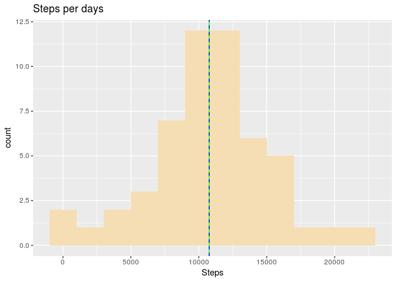
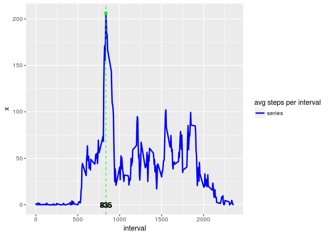
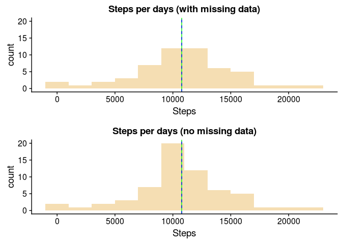
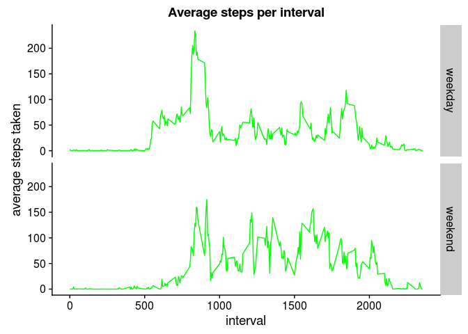

# Reproducible Research: Peer Assessment 1


## Loading and preprocessing the data
Let's unzip the original dataset and load to dataset variable

```r
unzip(zipfile = "activity.zip", overwrite = TRUE)
dataset <- read.csv("activity.csv")
```

Let's chack how the dataset looks like

```r
str(dataset)
```

```
## 'data.frame':	17568 obs. of  3 variables:
##  $ steps   : int  NA NA NA NA NA NA NA NA NA NA ...
##  $ date    : Factor w/ 61 levels "2012-10-01","2012-10-02",..: 1 1 1 1 1 1 1 1 1 1 ...
##  $ interval: int  0 5 10 15 20 25 30 35 40 45 ...
```

The data column is of Factor type. We should use it as date column. Let's convert it to Date type


```r
library(dplyr)
dataset <- dataset %>% transform(date = as.Date(as.character(dataset$date,"%Y-%M-%D")))
```

Now we are ready to perform our analisys

## What is mean total number of steps taken per day?
We need to calculate the steps number per day

```r
steps.per.day <- with(dataset, aggregate(steps, by = list(date = date), FUN = sum))
```

Then we can plot an histogram

```r
library(ggplot2)
qplot(x=steps.per.day$x, geom = "histogram", binwidth = 2000, main = "Steps per days", xlab = "Steps", fill=I("wheat"))+geom_vline(xintercept = median(steps.per.day$x, na.rm = TRUE), color = "green")+geom_vline(xintercept = mean(steps.per.day$x, na.rm = TRUE), color = "blue", linetype = "dashed")
```

```
## Warning: Removed 8 rows containing non-finite values (stat_bin).
```

<!-- -->

As you can see the mean (blue one) and the median (green one) overlaps, because they have a quite near value as the following code shows


```r
mean(steps.per.day$x, na.rm = TRUE)
```

```
## [1] 10766.19
```

```r
median(steps.per.day$x, na.rm = TRUE)
```

```
## [1] 10765
```
## What is the average daily activity pattern?
Let's calculate the average steps for each interval

```r
avg.steps.per.interval <- with(dataset, aggregate(steps, by = list(interval = interval) , FUN = mean, na.rm = TRUE))
```

Then plot the data

```r
maxX <- avg.steps.per.interval[which.max(avg.steps.per.interval$x), 1]
maxY <- max(avg.steps.per.interval$x)

ggplot(avg.steps.per.interval, aes(x=interval,y=x))+geom_line(aes(color = "series"), lwd = 1)+
geom_point(aes(x=maxX, y = maxY), color = "green")+
geom_vline(xintercept = maxX, color="green", linetype = "dashed", size = .5)+
geom_text(aes(x=maxX,y=0),label = maxX)+
scale_colour_manual(name="avg steps per interval", values=c(series="blue"))
```

<!-- -->

Interval 835 has the max average steps. It corresponds to 1.45 pm

## Imputing missing values
Let's count the missing values in the steps column

```r
sum(is.na(dataset$steps))
```

```
## [1] 2304
```


It corresponds to 13.11%.
So we could deal with missing data replacing them with the average steps value for the corresponding interval


```r
dataset2 <- merge(x = dataset,y= avg.steps.per.interval)
dataset2$steps <- coalesce(dataset2$steps,as.integer(round(dataset2$x,0)))
dataset2 <- subset(dataset2, select = -4)
```

Now, let's plot an histogram of the total steps per day with the new computed dataset.

```r
steps.per.day2 <- with(dataset2, aggregate(steps, by = list(date = date), FUN = sum))
p1 <- qplot(x=steps.per.day$x, geom = "histogram", binwidth = 2000, main = "Steps per days (with missing data)", xlab = "Steps", fill=I("wheat"))+coord_cartesian(ylim = c(0:20))+geom_vline(xintercept = median(steps.per.day$x, na.rm = TRUE), color = "green")+geom_vline(xintercept = mean(steps.per.day$x, na.rm = TRUE), color = "blue", linetype = "dashed")
p2 <- qplot(x=steps.per.day2$x, geom = "histogram", binwidth = 2000, main = "Steps per days (no missing data)", xlab = "Steps", fill=I("wheat"))+geom_vline(xintercept = median(steps.per.day2$x), color = "green")+geom_vline(xintercept = mean(steps.per.day2$x), color = "blue", linetype = "dashed")
library(cowplot)
plot_grid(p1,p2,align = "v",ncol=1)
```

```
## Warning: Removed 8 rows containing non-finite values (stat_bin).
```

<!-- -->

As you can see either median and mean value remains quite similar. In the second plot we can see how few days shift from the leftmost bars to the central one (which corresponds to day ranges from 8000 to 10000 steps).It is not a surprise at all!

## Are there differences in activity patterns between weekdays and weekends?

Let's start computing a new factor variable for the dataset with missing value. This variable will contain if a day is a weekday or a weekend


```r
dataset3 <- dataset
dataset3$weekday <- with(dataset3, factor(weekdays(date)%in%c("sabato","domenica"),levels = c(FALSE,TRUE), labels=c("weekday","weekend")))

str(dataset3)
```

```
## 'data.frame':	17568 obs. of  4 variables:
##  $ steps   : int  NA NA NA NA NA NA NA NA NA NA ...
##  $ date    : Date, format: "2012-10-01" "2012-10-01" ...
##  $ interval: int  0 5 10 15 20 25 30 35 40 45 ...
##  $ weekday : Factor w/ 2 levels "weekday","weekend": 1 1 1 1 1 1 1 1 1 1 ...
```

The str function shows the type of the weekday column.

Now let's plot a line chart showing the average steps taken in weekdays and weekend


```r
avg.steps.per.interval.byweekday <- with(dataset3, aggregate(steps, by = list(interval = interval, weekday = weekday), FUN = mean, na.rm = TRUE))

ggplot(data = avg.steps.per.interval.byweekday , aes(x=interval, y=x))+geom_line(color = "green")+facet_grid(weekday ~ .)+ylab(label = "average steps taken")+ggtitle("Average steps per interval")
```

<!-- -->

In general it looks like that fewer steps are taken in the earliest part of the day in the weekend.
